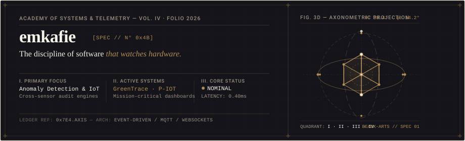
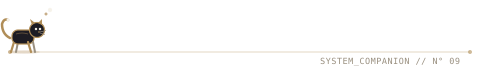

  

---

### ⚙️ Stack

  

---

### 📈 Activity & Telemetry

  

  

---

### 📡 Live Telemetry

<table>
  <tr>
    <td width="60%" valign="top" align="center">
      
<strong>🗓️ Isometric Contribution Cadence</strong>

      
    </td>
    <td width="40%" valign="top" align="center">
      
<strong>🎼 Now Playing (Last.fm)</strong>

      
    </td>
  </tr>
</table>

---

  

  Built with intention. <a href="https://github.com/emkafie/emkafie">View source</a> · Systems: <a href="https://github.com/emkafie/GreenTrace">GreenTrace</a> · <a href="https://github.com/emkafie/pbl-chaos">P-IOT</a> · <a href="https://github.com/emkafie/NeoClassic-UI-template">NeoClassic UI</a>

